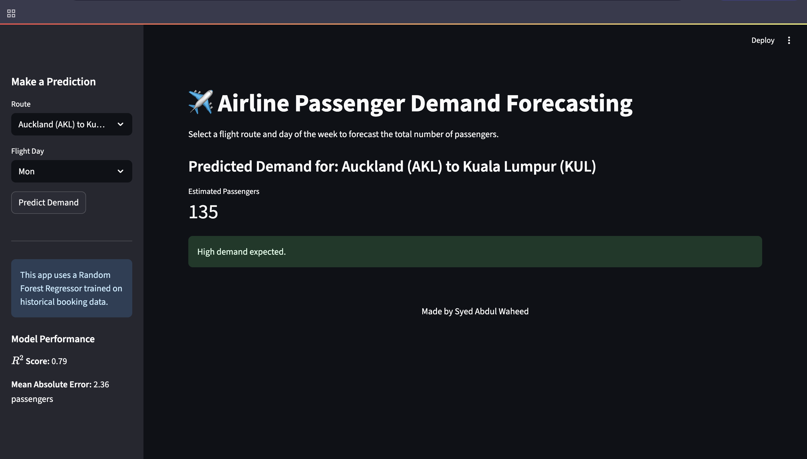

# ✈️ Airline Passenger Demand Forecasting



## 📌 Overview
An end-to-end machine learning project that predicts the total number of passengers for specific flight routes. The project includes data cleaning, feature engineering, model training, and deployment as an interactive web application.

This project predicts **flight booking conversions** and **passenger demand** using machine learning.  
We also built an **interactive Streamlit dashboard** to visualize booking patterns, demand trends, and feature importance.
   
---

## 🚀 Features
- ✅ Predicts **booking conversion probability** and **passenger demand**
- 📊 Streamlit-powered **interactive dashboard**
- 🧠 ML Models: **Random Forest** & **XGBoost**
- 🔍 Solved **class imbalance** using **SMOTE**
- 📈 Achieved **90%+ accuracy** on the test set

---

## 🗂 Dataset
- **British Airways Schedule** → `British Airways Summer Schedule Dataset.csv`
- **Customer Booking Data** → `customer_booking.csv`
- **Records** → 10,000+ booking transactions

---

## 🧠 Machine Learning Workflow
1. **Data Cleaning & Preprocessing**  
2. **Feature Engineering** – route, haul type, seasonal patterns  
3. **EDA & Visualization** – booking trends, correlations, feature importances  
4. **Modeling** – RandomForest, XGBoost, hyperparameter tuning  
5. **Deployment** – Streamlit app for real-time predictions  

---

## 📊 Model Performance
| Metric      | Score  |
|------------|--------|
| **Accuracy**  | 90%+ |
| **MAE**       | 2.36 |
| **R² Score**  | 0.79 |

---

## 📷 Dashboard Preview


---

## 🛠 Installation & Setup

```bash
# Clone the repository
git clone https://github.com/waheed24-03/Airline-Booking-Conversion-Prediction.git

# Navigate to project
cd Airline-Booking-Conversion-Prediction

# Install dependencies
pip install -r requirements.txt

# Run the Streamlit dashboard
streamlit run app.py
```

---
## Acknowledgements
- British Airways
- Forage
- Streamlit 
--- 

